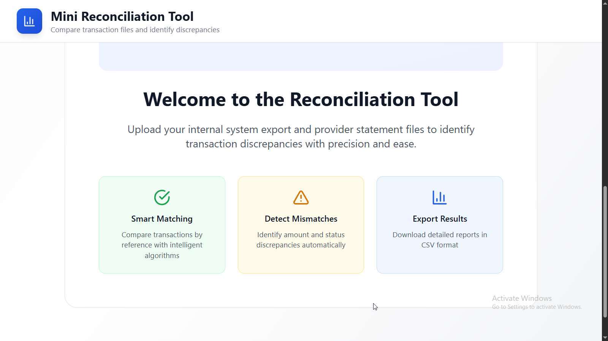
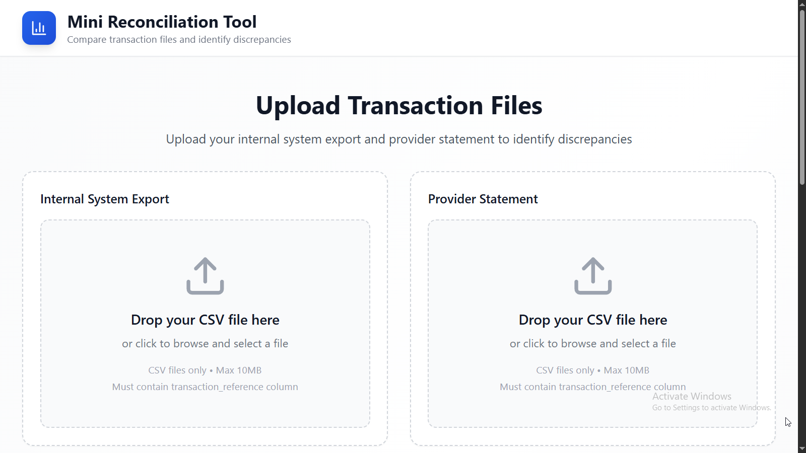
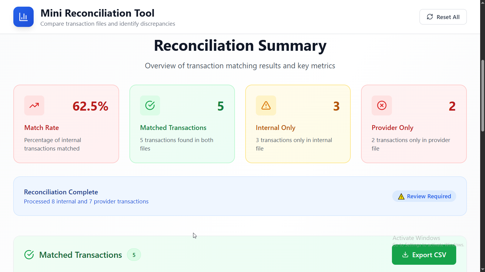
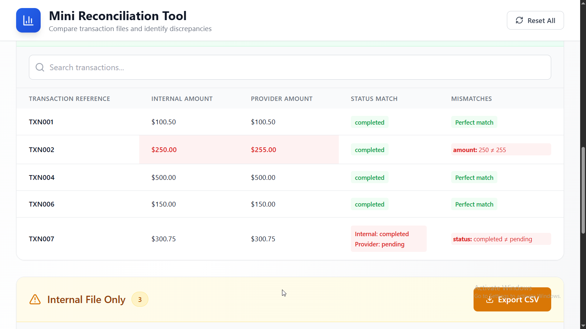

# Mini Reconciliation Tool


A modern, web-based reconciliation tool that compares transaction data between internal systems and payment processors to identify discrepancies, ensuring financial accuracy and compliance.

## LIVE LINK IS HERE: https://eclectic-klepon-0c84a9.netlify.app/


## 🎯 Overview

The Mini Reconciliation Tool streamlines the process of comparing transaction files from different sources, automatically identifying matches, mismatches, and discrepancies. Built with modern web technologies, it provides an intuitive interface for financial teams to ensure data accuracy across systems.

Here's what the main dashboard looks like:



### Key Features

- **🔄 Smart Transaction Matching** - Automatically matches transactions by reference ID with intelligent algorithms
- **📊 Real-time Discrepancy Detection** - Identifies amount, status, and date mismatches with visual highlighting
- **📈 Professional Reporting** - Comprehensive summary dashboard with key metrics and statistics
- **💾 Export Capabilities** - Download detailed reports in CSV format for each category
- **📱 Responsive Design** - Works seamlessly across desktop, tablet, and mobile devices
- **🚀 Client-side Processing** - No server required, all processing happens in your browser for maximum security

## 🛠️ Technology Stack

- **Frontend Framework**: React 18 with TypeScript
- **Build Tool**: Vite with hot module replacement
- **Styling**: Tailwind CSS with responsive design
- **CSV Processing**: Papa Parse library for robust file handling
- **Icons**: Lucide React icon library
- **Development**: ESLint for code quality

## 📋 How It Works

### 1. File Upload
- Drag and drop or click to upload CSV files (max 10MB)
- Supports internal system exports and provider statements
- Real-time validation and error handling
- Automatic detection of required columns

Screenshot:


### 2. Data Processing
- Parses CSV files with header detection
- Validates transaction_reference column presence
- Cleans and normalizes data for comparison
- Handles various amount formats and currencies

### 3. Reconciliation Engine
- Matches transactions by transaction_reference
- Compares amounts with ±$0.01 tolerance for floating-point precision
- Detects status and date discrepancies
- Categorizes results into matched, internal-only, and provider-only

### 4. Results Dashboard
- **Matched Transactions**: Perfect matches and matches with field mismatches
- **Internal Only**: Transactions present only in internal system
- **Provider Only**: Transactions present only in provider statement
- Visual highlighting of specific field differences

Screenshot:


Screenshot:


### 5. Export & Analysis
- Export each category to CSV with timestamped filenames
- Search and pagination for large datasets
- Detailed mismatch analysis with field-level comparisons

## 🚀 Getting Started

### Prerequisites

- Node.js 18+ and npm
- Modern web browser with ES2020+ support

### Installation

1. **Clone the repository**
   ```bash
   git clone <repository-url>
   cd mini-reconciliation-tool
   ```

2. **Install dependencies**
   ```bash
   npm install
   ```

3. **Start development server**
   ```bash
   npm run dev
   ```

4. **Open in browser**
   ```
   http://localhost:5173
   ```

### Using the Tool

1. **Prepare your CSV files** with the following requirements:
   - Must contain a `transaction_reference` column
   - Recommended columns: `amount`, `status`, `date`, `description`
   - UTF-8 encoding
   - Headers in the first row

2. **Upload files**:
   - Upload your internal system export
   - Upload your provider statement

3. **Run reconciliation** and review results

4. **Export reports** for further analysis

## 📁 Project Structure

```
mini-reconciliation-tool/
├── src/
│   ├── components/          # React components
│   │   ├── ErrorBoundary.tsx
│   │   ├── FileUpload.tsx
│   │   ├── LoadingSpinner.tsx
│   │   ├── ReconciliationSummary.tsx
│   │   └── TransactionTable.tsx
│   ├── types/              # TypeScript type definitions
│   │   └── transaction.ts
│   ├── utils/              # Utility functions
│   │   ├── csvProcessor.ts
│   │   └── reconciliation.ts
│   ├── App.tsx             # Main application component
│   ├── main.tsx           # Application entry point
│   └── index.css          # Global styles
├── test-data/             # Sample CSV files for testing
├── docs/                  # Product documentation
├── public/               # Static assets
└── package.json          # Dependencies and scripts
```

## 🧪 Testing

### Sample Data

The `test-data/` directory contains sample CSV files for testing:

- `internal-system.csv` - 8 sample internal transactions
- `provider-statement.csv` - 7 sample provider transactions

### Expected Results
- **Match Rate**: ~67%
- **Matched Transactions**: 6 (4 perfect + 2 with mismatches)
- **Internal Only**: 3 transactions
- **Provider Only**: 2 transactions

### Running Tests

```bash
# Lint code
npm run lint

# Build for production
npm run build

# Preview production build
npm run preview
```

## 🌐 Deployment

### Option 1: Netlify (Recommended)

1. **Build the project**
   ```bash
   npm run build
   ```

2. **Deploy to Netlify**
   - Connect your repository to Netlify
   - Set build command: `npm run build`
   - Set publish directory: `dist`
   - Deploy automatically on push

### Option 2: Vercel

1. **Install Vercel CLI**
   ```bash
   npm i -g vercel
   ```

2. **Deploy**
   ```bash
   vercel --prod
   ```

### Option 3: GitHub Pages

1. **Install gh-pages**
   ```bash
   npm install --save-dev gh-pages
   ```

2. **Add to package.json**
   ```json
   {
     "scripts": {
       "deploy": "gh-pages -d dist"
     },
     "homepage": "https://yourusername.github.io/mini-reconciliation-tool"
   }
   ```

3. **Deploy**
   ```bash
   npm run build
   npm run deploy
   ```

### Option 4: Static File Hosting

1. **Build the project**
   ```bash
   npm run build
   ```

2. **Upload the `dist/` folder** to any static hosting service:
   - AWS S3 + CloudFront
   - Google Cloud Storage
   - Azure Static Web Apps
   - Firebase Hosting

## 📊 CSV File Requirements

### Required Columns
- `transaction_reference` - Unique identifier for matching (required)

### Recommended Columns
- `amount` - Transaction amount (numeric)
- `status` - Transaction status (e.g., completed, pending, failed)
- `date` - Transaction date
- `description` - Transaction description

### Example CSV Format
```csv
transaction_reference,amount,status,date,description
TXN001,100.50,completed,2024-01-15,Payment for Order #1234
TXN002,250.00,pending,2024-01-15,Subscription renewal
TXN003,75.25,failed,2024-01-16,Refund request
```

## ⚠️ Limitations

- **Client-side only**: No server-side processing or data persistence
- **File size limit**: 10MB maximum per file (~50,000 transactions)
- **CSV format only**: Does not support Excel, JSON, or other formats
- **Exact matching**: Uses exact reference matching (no fuzzy matching)
- **Browser memory**: Large files may impact browser performance

## 🔒 Security & Privacy

- **Local processing**: All data processing happens in your browser
- **No data transmission**: Files are never uploaded to external servers
- **No data storage**: No data is stored or cached after processing
- **Client-side only**: Maximum data security and privacy

## 🤝 Contributing

1. Fork the repository
2. Create a feature branch (`git checkout -b feature/amazing-feature`)
3. Commit your changes (`git commit -m 'Add amazing feature'`)
4. Push to the branch (`git push origin feature/amazing-feature`)
5. Open a Pull Request

## 📄 License

This project is licensed under the MIT License - see the [LICENSE](LICENSE) file for details.

## 🆘 Support

For support, please:
1. Check the [documentation](docs/)
2. Review the [test data examples](test-data/)
3. Open an issue on GitHub
4. Contact the development team

## 🗺️ Roadmap

### Phase 3 - Future Enhancements
- [ ] Batch processing for multiple file pairs
- [ ] Custom matching rules and field mapping
- [ ] API integration for automated data fetching
- [ ] Advanced reporting with charts and graphs
- [ ] Fuzzy matching algorithms
- [ ] Excel file support
- [ ] Scheduled reconciliation jobs

---

**Built with ❤️ using React, TypeScript, and Tailwind CSS**
