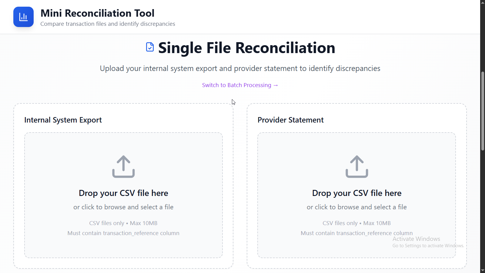

# Mini Reconciliation Tool


A modern, web-based reconciliation tool that compares transaction data between internal systems and payment processors to identify discrepancies, ensuring financial accuracy and compliance. Now with **powerful batch processing capabilities** for handling multiple file pairs simultaneously!

## You can test the App here: [https://mini-recon-tool.netlify.app/](https://mini-recon-tool.netlify.app/)

## 🎯 Overview

The Mini Reconciliation Tool streamlines the process of comparing transaction files from different sources, automatically identifying matches, mismatches, and discrepancies. Built with modern web technologies, it provides an intuitive interface for financial teams to ensure data accuracy across systems.


### Key Features

#### Core Reconciliation Features
- **🔄 Smart Transaction Matching** - Automatically matches transactions by reference ID with intelligent algorithms
- **📊 Real-time Discrepancy Detection** - Identifies amount, status, and date mismatches with visual highlighting
- **📈 Professional Reporting** - Comprehensive summary dashboard with key metrics and statistics
- **💾 Export Capabilities** - Download detailed reports in CSV format for each category
- **📱 Responsive Design** - Works seamlessly across desktop, tablet, and mobile devices
- **🚀 Client-side Processing** - No server required, all processing happens in your browser for maximum security

#### 🆕 NEW: Batch Processing Features
- **📁 Multi-File Upload** - Upload multiple internal and provider files simultaneously
- **🔗 File Pairing Interface** - Intuitive drag-and-drop interface for creating file pairs
- **⚡ Batch Reconciliation** - Process multiple file pairs with queue management
- **📊 Aggregate Reporting** - Combined statistics and insights across all processed pairs
- **📈 Progress Tracking** - Real-time progress updates during batch processing
- **📦 Bulk Export** - Export all results in a comprehensive report bundle
- **🎯 Individual Results** - Expandable detailed view for each file pair
- **🔄 Mode Switching** - Seamlessly switch between single-file and batch processing

## 🛠️ Technology Stack

- **Frontend Framework**: React 18 with TypeScript
- **Build Tool**: Vite with hot module replacement
- **Styling**: Tailwind CSS with responsive design
- **CSV Processing**: Papa Parse library for robust file handling
- **Icons**: Lucide React icon library
- **Development**: ESLint for code quality

## 📋 How It Works

### 1. File Upload
- Drag and drop or click to upload CSV files (max 10MB)
- Supports internal system exports and provider statements
- Real-time validation and error handling
- Automatic detection of required columns

Screenshots Showing Uploads:



### 2. Data Processing
- Parses CSV files with header detection
- Validates transaction_reference column presence
- Cleans and normalizes data for comparison
- Handles various amount formats and currencies

### 3. Reconciliation Engine
- Matches transactions by transaction_reference
- Compares amounts with ±$0.01 tolerance for floating-point precision
- Detects status and date discrepancies
- Categorizes results into matched, internal-only, and provider-only

### 4. Results Dashboard
- **Matched Transactions**: Perfect matches and matches with field mismatches
- **Internal Only**: Transactions present only in internal system
- **Provider Only**: Transactions present only in provider statement
- Visual highlighting of specific field differences

Screenshot showing the reconciliation output:


### 5. Export & Analysis
- Export each category to CSV with timestamped filenames
- Search and pagination for large datasets
- Detailed mismatch analysis with field-level comparisons

## 🆕 Batch Processing Mode

The Mini Reconciliation Tool now includes powerful batch processing capabilities for handling multiple file pairs efficiently. This feature is perfect for organizations that need to process large volumes of reconciliation data regularly.

### How Batch Processing Works

#### 1. Mode Selection
- Choose between **Single File Mode** (traditional one-to-one comparison) or **Batch Processing Mode**
- Easy toggle between modes with preserved functionality
- Contextual UI that adapts to your selected processing method

#### 2. Multi-File Upload
- **Drag & Drop Multiple Files**: Upload multiple CSV files simultaneously
- **Separate Upload Areas**: Distinct zones for internal system files and provider statements
- **File Management**: Add, remove, and organize files before processing
- **Real-time Validation**: Instant feedback on file format and content

#### 3. File Pairing Interface
- **Visual Pairing**: Intuitive interface for creating file pairs
- **Flexible Matching**: Pair any internal file with any provider file
- **Pair Management**: Add, remove, and modify file pairs as needed
- **Validation**: Ensure all pairs are valid before processing

#### 4. Batch Processing Engine
- **Queue Management**: Process multiple file pairs in sequence
- **Progress Tracking**: Real-time updates showing current progress
- **Error Handling**: Graceful handling of individual pair failures
- **Performance Optimization**: Efficient processing with minimal browser impact

#### 5. Aggregate Results Dashboard
- **Combined Statistics**: Overall metrics across all processed pairs
- **Success Rate Tracking**: Monitor processing success and failure rates
- **Individual Pair Results**: Expandable sections for detailed pair analysis
- **Visual Progress**: Progress bars and status indicators

#### 6. Comprehensive Export Options
- **Bulk Export**: Download all results in a single operation
- **Summary Reports**: Text-based aggregate statistics and insights
- **Individual CSVs**: Separate files for each pair's reconciliation results
- **Timestamped Files**: Organized exports with clear naming conventions

### Batch Processing Benefits

✅ **Efficiency**: Process multiple reconciliations simultaneously  
✅ **Time Savings**: Reduce manual file handling and processing time  
✅ **Consistency**: Standardized processing across all file pairs  
✅ **Visibility**: Clear overview of processing status and results  
✅ **Scalability**: Handle larger reconciliation workloads  
✅ **Organization**: Structured results with comprehensive reporting  

### When to Use Batch Processing

- **Regular Reconciliation Cycles**: Monthly, weekly, or daily reconciliations
- **Multiple Business Units**: Different divisions or departments
- **Multiple Payment Processors**: Various provider statements to reconcile
- **Historical Data Processing**: Batch processing of past periods
- **Large Data Volumes**: When dealing with numerous transaction files

### Batch Processing Workflow

1. **Select Batch Mode** from the main interface
2. **Upload Files** - Add multiple internal and provider files
3. **Create Pairs** - Use the pairing interface to match files
4. **Start Processing** - Run batch reconciliation on all pairs
5. **Monitor Progress** - Watch real-time progress updates
6. **Review Results** - Examine aggregate and individual results
7. **Export Reports** - Download comprehensive result bundles

## 🚀 Getting Started

### Prerequisites

- Node.js 18+ and npm
- Modern web browser with ES2020+ support

### Installation

1. **Clone the repository**
   ```bash
   git clone <repository-url>
   cd mini-reconciliation-tool
   ```

2. **Install dependencies**
   ```bash
   npm install
   ```

3. **Start development server**
   ```bash
   npm run dev
   ```

4. **Open in browser**
   ```
   http://localhost:5173
   ```

### Using the Tool

1. **Prepare your CSV files** with the following requirements:
   - Must contain a `transaction_reference` column
   - Recommended columns: `amount`, `status`, `date`, `description`
   - UTF-8 encoding
   - Headers in the first row

2. **Upload files**:
   - Upload your internal system export
   - Upload your provider statement

3. **Run reconciliation** and review results

4. **Export reports** for further analysis

## 🧪 Testing with Sample Data

The `test-data/` directory contains comprehensive CSV files for various testing scenarios:

- **Basic Test Files:**
  - `internal-system.csv` - 8 sample internal transactions
  - `provider-statement.csv` - 7 sample provider transactions
- **Extended Datasets:**
  - `large-internal-system.csv` - 55 transactions for extended testing
  - `large-provider-statement.csv` - 50 transactions with varied scenarios
- **Edge Case Files:**
  - `edge-case-internal.csv` - Edge cases with 27 transactions
  - `edge-case-provider.csv` - Edge cases with 31 transactions
- **Error Testing Files:**
  - `invalid-missing-columns.csv` - Test for invalid columns
  - `empty-file.csv` - Empty dataset
- **Performance Test Files:**
  - `performance-test-internal.csv` - Structured data for performance testing
  - `generate-large-dataset.ps1` - PowerShell script for generating large data

### Testing Scenarios

#### Single File Mode Testing
1. **Basic Functionality**: Use `internal-system.csv` and `provider-statement.csv`
2. **Large Dataset Testing**: Use the large CSV files to test pagination and performance
3. **Edge Case Testing**: Use edge-case files to test various data formats
4. **Error Handling**: Use invalid files to test error handling
5. **Performance Testing**: Use the PowerShell script to generate large datasets

#### Batch Processing Mode Testing
6. **Multi-File Upload**: Test uploading multiple files in each category
7. **File Pairing**: Create various file pair combinations and test validation
8. **Batch Processing**: Process multiple pairs simultaneously
9. **Progress Tracking**: Monitor real-time progress during batch operations
10. **Aggregate Reporting**: Verify combined statistics across multiple pairs
11. **Bulk Export**: Test comprehensive export functionality
12. **Error Recovery**: Test batch processing with some failing pairs
13. **Large Batch Operations**: Process numerous file pairs for performance testing

## 📊 CSV File Requirements

### Required Columns
- `transaction_reference` - Unique identifier for matching (required)

### Recommended Columns
- `amount` - Transaction amount (numeric)
- `status` - Transaction status (e.g., completed, pending, failed)
- `date` - Transaction date
- `description` - Transaction description

### Example CSV Format
```csv
transaction_reference,amount,status,date,description
TXN001,100.50,completed,2024-01-15,Payment for Order #1234
TXN002,250.00,pending,2024-01-15,Subscription renewal
TXN003,75.25,failed,2024-01-16,Refund request
```

## 🔒 Security & Privacy

- **Local processing**: All data processing happens in your browser
- **No data transmission**: Files are never uploaded to external servers
- **No data storage**: No data is stored or cached after processing
- **Client-side only**: Maximum data security and privacy

## ⚠️ Limitations

- **Client-side only**: No server-side processing or data persistence
- **File size limit**: 10MB maximum per file (~50,000 transactions)
- **CSV format only**: Does not support Excel, JSON, or other formats
- **Exact matching**: Uses exact reference matching (no fuzzy matching)
- **Browser memory**: Large files may impact browser performance

## 🤝 Contributing

1. Fork the repository
2. Create a feature branch (`git checkout -b feature/amazing-feature`)
3. Commit your changes (`git commit -m 'Add amazing feature'`)
4. Push to the branch (`git push origin feature/amazing-feature`)
5. Open a Pull Request

## 📄 License

This project is licensed under the MIT License - see the [LICENSE](LICENSE) file for details.

## 🆘 Support

For support, please:
1. Check the [documentation](docs/)
2. Review the [test data examples](test-data/)
3. Open an issue on GitHub
4. Contact the development team

---

**Built with ❤️ using React, TypeScript, and Tailwind CSS**
